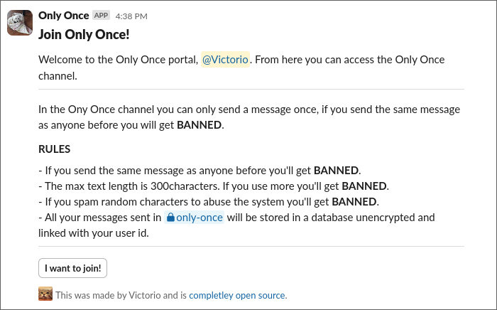

# Only once slack

Only Once is a slack bot that manages a channel in which message contents are only allowed to be posted once.

If anyone tries to post a message that has already been posted, the bot will ban the inmedialty.

It uses a sqlite database to store the messages that have been posted on the only once channel.

It uses a channel for logging, another for the only once channel and another for the portal to join the only once channel.

